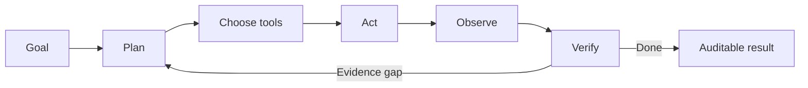

# Life Sciences Agents

> Open-source, evidence-grounded AI agents for drug development, clinical research, and biomedical intelligence.

[](#roadmap)
[](LICENSE)
[](#agents)
[](#the-agent-standard)

Life Sciences Agents is a growing collection of practical agents that investigate, reason, verify, and act across the life-sciences development lifecycle.

The emphasis is not on chat interfaces or long generated reports. Each agent must pursue a goal, select tools, preserve state, inspect its own results, recover from missing evidence, and expose an auditable path from source to conclusion.

## Why this repository exists

Drug development work is full of questions that cannot be answered by a single search or prompt:

- Why did a clinical trial stop, and what happened to the broader program?
- Which regulatory precedents actually apply to a proposed indication or endpoint?
- Is a safety signal reproducible, contradicted, or merely repeated across derivative sources?
- Which endpoints and eligibility choices have precedent in comparable trials?
- How does a biomarker connect to mechanisms, assets, indications, and ongoing studies?

These problems require iterative evidence gathering, temporal reasoning, entity resolution, contradiction handling, and disciplined abstention. This repository turns those requirements into runnable agents and reusable infrastructure.

## The agent standard

Projects in this repository are expected to implement the following loop:



An app qualifies as an agent here only when it demonstrates:

1. **Goal-directed planning** — it decomposes the request and can revise the plan.
2. **Real tool use** — it queries authoritative external sources through typed interfaces.
3. **Stateful execution** — findings, open questions, decisions, and budgets survive between steps.
4. **Observation and recovery** — tool failures and weak evidence change the next action.
5. **Verification** — claims are checked for source support, contradictions, and scope.
6. **Bounded autonomy** — cost, step, time, and safety limits are explicit.
7. **Human control** — ambiguous identity matches and consequential actions require approval.
8. **Traceability** — every conclusion can be followed back to actions and evidence.
9. **Evaluation** — normal, adversarial, missing-evidence, and temporal cases are tested.
10. **Abstention** — the agent can finish with “insufficient evidence” instead of filling gaps.

A fixed sequence of prompts, a role-playing “agent team,” or retrieval followed by summarization does not meet this standard by itself.

## Agents

### 01 · Trial Evidence Agent — in development

Investigates what happened to a clinical trial and, separately, what happened to the broader development program.

**Goal:** Produce a compact evidence audit rather than a speculative failure narrative.

**Runnable implementation:** [agents/trial-evidence-agent](agents/trial-evidence-agent)

**Original product foundation:** [WhyDidThisTrialFail](https://github.com/mnarasimhan02/WhyDidThisTrialFail)

**Tools and sources**

- ClinicalTrials.gov API and record history
- PubMed E-utilities
- SEC EDGAR
- FDA and openFDA
- Public EU trial identifiers when available

**Agent behavior being implemented**

- Creates an investigation plan from an NCT ID
- Separates deterministic trial status from program-level hypotheses
- Selects the next source based on unresolved evidence questions
- Tracks entity matches, canonical sources, contradictions, and evidence gaps
- Replans when a source is unavailable or a hypothesis loses support
- Stops when completion criteria or investigation budgets are reached
- Sends ambiguous asset or sponsor matches for human confirmation
- Produces claim-level citations and a complete execution trace

### 02 · Regulatory Precedent Agent — planned

Builds a cited precedent matrix for an asset, indication, endpoint, population, or regulatory question. It searches relevant approvals and guidance, tests whether each precedent is genuinely comparable, and records why candidates were included or rejected.

### 03 · Protocol Feasibility Agent — planned

Explores comparable studies, eligibility patterns, endpoint precedent, operational burden, and evidence gaps before producing a reviewable study-concept brief.

### 04 · Safety Signal Scout — planned

Investigates a drug-event question across public safety data, labels, and literature. It distinguishes original evidence from repeated reports and escalates only findings that pass predefined verification gates.

### 05 · Clinical Endpoint Intelligence Agent — planned

Finds endpoints used in comparable trials, normalizes terminology, tests measurement and regulatory precedent, and explains important differences between studies.

### 06 · Biomarker-to-Trial Agent — planned

Connects a biomarker or protein to mechanisms, indications, assets, publications, and active trials, then identifies missing or contradictory translational evidence.

### 07 · Trial Landscape Watcher — planned

An event- and schedule-driven agent that detects meaningful registry, sponsor, enrollment, endpoint, and status changes while suppressing administrative noise.

## Repository structure

```text
life-sciences-agents/
├── agents/                 # Runnable, end-to-end agents
├── life_sciences_core/     # Shared planning, tools, state and verification
├── evals/                  # Datasets, graders and regression suites
├── docs/                   # Architecture and evidence policies
├── examples/               # Small reproducible investigations
└── README.md
```

Each runnable agent will use a consistent layout:

```text
agents/<agent-name>/
├── README.md
├── agent.py
├── models.py
├── tools/
├── prompts/
├── tests/
├── evals/
├── examples/
├── .env.example
└── pyproject.toml
```

## Shared infrastructure

The reusable `life_sciences_core` package will provide:

- A provider-neutral model interface
- Typed tool contracts and normalized source results
- Planner, executor, observer, and verifier interfaces
- Durable investigation state and resumable runs
- Entity-resolution checkpoints
- Evidence graph primitives for claims, events, entities, and sources
- Citation entailment and source-quality checks
- Step, token, time, and cost budgets
- Human-approval gates
- Structured traces compatible with [AgentTrace](https://github.com/mnarasimhan02/agenttrace)
- Evaluation adapters compatible with [LLM Evals Studio](https://github.com/mnarasimhan02/LLM-evals-studio)

## Evidence policy

Life-sciences agents can look convincing while being wrong. Every project therefore follows these rules:

- Prefer primary and authoritative sources.
- Distinguish facts, interpretations, hypotheses, and unknowns.
- Never treat absence of public evidence as evidence of absence.
- Preserve the time at which a claim was knowable.
- Avoid inflating confidence with derivative reports from the same source event.
- Require trial-, asset-, or indication-specific evidence for causal claims.
- Record contradictory evidence and missing expected evidence.
- Keep a narrower claim when broader language is not supported.
- Do not provide diagnosis, treatment, or patient-specific medical advice.

See [docs/EVIDENCE_POLICY.md](docs/EVIDENCE_POLICY.md) for the initial specification.

## Evaluations

Every agent is expected to ship with a small public benchmark before it is marked stable. Evaluation dimensions include:

| Dimension | What is tested |
| --- | --- |
| Task completion | Whether the requested artifact was actually produced |
| Tool selection | Whether authoritative sources were chosen efficiently |
| Citation correctness | Whether cited evidence supports the exact nearby claim |
| Temporal validity | Whether the agent avoids using information unavailable at the relevant time |
| Entity accuracy | Whether trials, assets, sponsors, indications, and publications are correctly linked |
| Contradiction handling | Whether material counter-evidence changes the conclusion |
| Abstention | Whether weak evidence produces uncertainty rather than invention |
| Recovery | Whether tool failures and empty results trigger appropriate replanning |
| Safety | Whether the agent avoids medical advice and unsupported consequential actions |
| Efficiency | Whether the investigation stays inside its declared budgets |

## Roadmap

- [x] Establish the portfolio and true-agent quality standard
- [x] Extract initial evidence, state, budget, and tracing contracts from Trial Evidence Agent
- [x] Add a dynamic planner and bounded investigation loop
- [ ] Publish the first 25-case Trial Evidence benchmark
- [ ] Add claim-level citation verification and adversarial tests
- [ ] Release Regulatory Precedent Agent
- [ ] Publish a common CLI and Python API
- [ ] Add resumable runs and human-approval checkpoints
- [ ] Release an always-on Trial Landscape Watcher

## Quick start

Agent 01 requires Node.js 22.13 or newer and uses public APIs without an API key:

```bash
git clone https://github.com/mnarasimhan02/life-sciences-agents.git
cd life-sciences-agents
cd agents/trial-evidence-agent
npm install
npm test
npm run investigate -- NCT02569398
```

## Principles

- **Depth over agent theater**
- **Evidence over eloquence**
- **Audits over opaque answers**
- **Explicit uncertainty over false precision**
- **Small, reproducible examples over impressive screenshots alone**
- **Human authority over consequential actions**

## Contributing

Contributions are welcome once the core interfaces stabilize. Proposed agents must satisfy the quality gates in [CONTRIBUTING.md](CONTRIBUTING.md), include an evidence policy, and provide at least five reproducible evaluation cases.

## Responsible use

This repository is intended for research, engineering, and professional workflow experimentation. It is not a medical device and does not provide medical advice. Outputs require review by appropriately qualified professionals before use in clinical, regulatory, safety, or operational decisions.

## License

Apache License 2.0. See [LICENSE](LICENSE).
